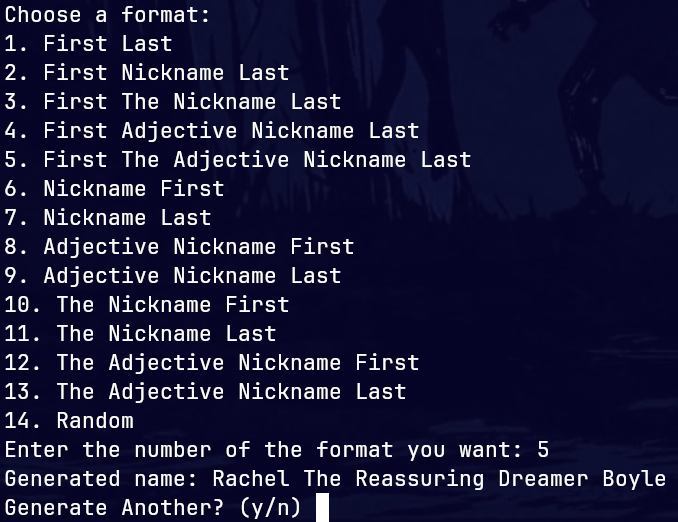

# Ultimate Name Generator

> A random name generator written in python that generates names in multiple formats

Ultimate Name Generator pulls random names from long lists stored in txt files that you can customize to your specific naming needs.




## Use

```sh
chmod +x ultimate-name-generator
```

```sh
./ultimate-name-generator
```

Alternately just add the file to your path.
